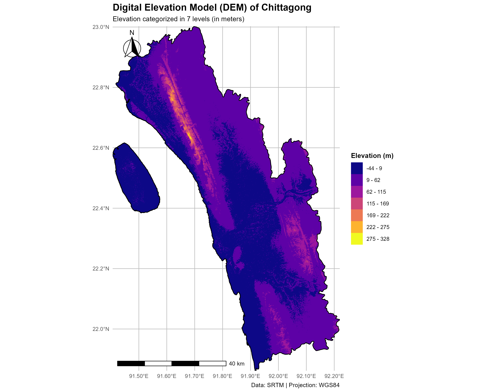
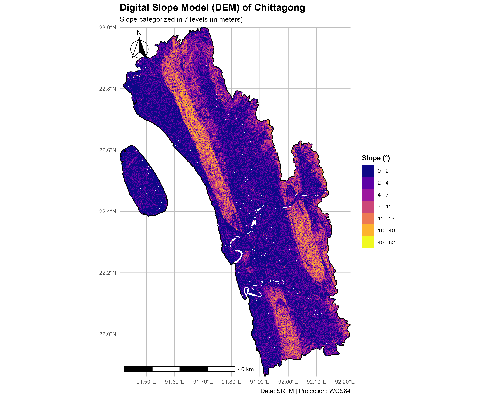

# Spatial-Analysis-Using-R-Elevation-and-Slope-
📍 Project Overview
This project focuses on geospatial analysis of the Chittagong District using Digital Elevation Model (DEM) data to visualize elevation and slope characteristics. The objective is to produce high-quality thematic maps that can be useful for environmental studies, infrastructure planning, and disaster risk assessment such as landslide vulnerability.

🗂️ Contents
Clipping and preprocessing of raster DEM data

Calculation of slope from elevation data

Reclassification of elevation and slope values into intervals

Visualization using ggplot2 and RColorBrewer color palettes

Exporting results  PNG formats

🛠️ Tools and Libraries Used
R (programming language)

raster, sf, ggplot2, tidyverse, classInt, RColorBrewer, viridis

🗺️ Data Sources
DEM Data: Shuttle Radar Topography Mission (SRTM) Global link: https://opentopography.org/

Administrative Boundaries: Shapefile of Chittagong District link: https://diva-gis.org/

📊 Methodology
Load and Process DEM: Import the DEM raster and crop it using the district boundary shapefile.

Elevation Mapping:

Reclassify elevation values into defined intervals.

Visualize using geom_raster() and a YlOrBr color palette.

Slope Calculation:

Use the terrain() function to calculate slope (in degrees).

Classify using Jenks natural breaks for meaningful grouping.

Visualize using the RdYlGn color palette.

Export Results: Save the clipped rasters and PNG visualizations for further use.

### 🌄 Elevation Map

### ⛰️ Slope Map

PNG maps for elevation and slope with customized legends and color intervals

📌 Applications

Environmental impact studies

Flood and landslide hazard assessments

Infrastructure development planning

Land use suitability analysis

📎 Credits
Digital Elevation Data by NASA SRTM

Shapefile data collected from local GIS sources or digitized
